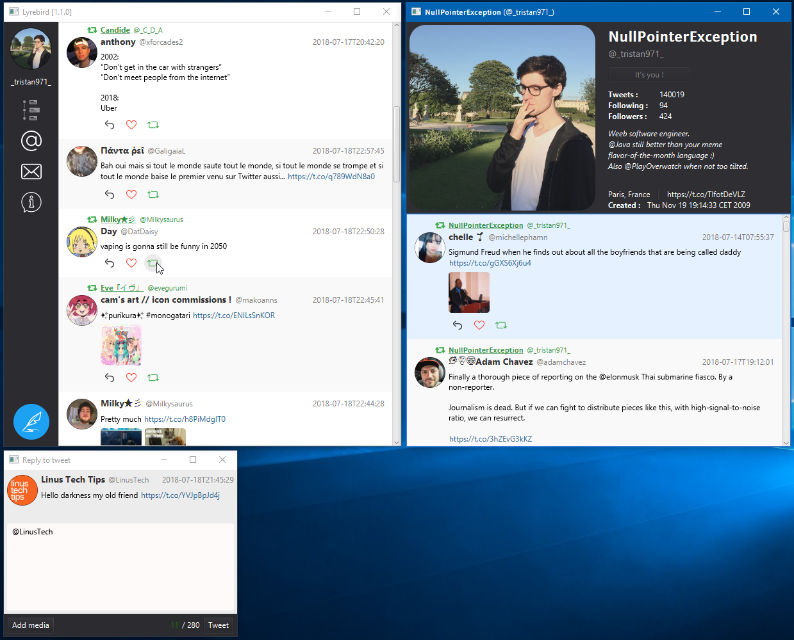

Last `develop` branch's (version 1.1.0) statistics :

## Reasoning :
There are currently no effective Twitter clients on Windows and Linux.
The goal of Lyrebird is to fix this, support macOS, and remain fully open-source.

Hopefully this works out.

## How to get it

#### [Precompiled releases](https://github.com/Tristan971/Lyrebird/releases)

#### Build it yourself

Requirements:
- A Java 10+ development kit with JavaFX components included (i.e. an Oracle JDK or an OpenJDK+OpenJFX combo)
- Apache Maven (works at least with version 3.5.2)
- For native images you need either InnoSetup tools on Windows or ``dpkg-deb``/``rpmutils`` on Linux depending on
what system you want to target. You can only build native images for the current system type.

First (in project folder) : ``$> mvn clean install -DskipTests``

Then any of the following (in ``Lyrebird/lyrebird` folder):
- Execute only (no packaging) : ``$> mvn clean spring-boot:run``
- For a native image (in ``Lyrebird/lyrebird/target/jfx/native``) : ``$> mvn jfx:native -DskipTests``
- For a portable JAR file (in ``Lyrebird/lyrebird/target``) : ``$> mvn clean package -DskipTests``

## What does it look like?

## Current state of development:

- [x] Log in 
- [ ] Tweets-based systems
    - [x] Base systems :
        - [x] Timeline
        - [x] Mentions
        - [x] Direct messages
    - [ ] Display features :
        - [x] Basic textual display
        - [x] Display username, @screenname and user profile picture
        - [ ] Display for chosen list
        - [ ] Text highlighting
            - [ ] Mentions
                - [ ] Color
                - [ ] Clickable
            - [ ] Hashtags
                - [ ] Color
                - [ ] Clickable
            - [x] URLs
                - [x] Color
                - [x] Clickable
        - [ ] Media embedding
            - [ ] Officially supported
                - [x] Twitter image embedding
                - [x] Twitter video embedding
                - [ ] Twitter gif images embedding
            - [ ] Easy embedding
                - [ ] Direct image embedding
                - [ ] Direct video embedding
            - [ ] Why is it not easy to do ?
                - [ ] Youtube video embedding
    - [x] Data loading features :
        - [x] Seeking older tweets by-demand (scroll or button)
        - [x] Seek newer tweets all the time using streaming API

- [ ] Tweeting
    - [x] Support text
    - [x] Support attachments
    - [ ] Support geolocation
    
- [ ] Interraction with tweet
    - [ ] Reply
    - [ ] Quote
    - [x] Like (formerly _favourite_)
    - [x] Retweet

- [ ] Searches

- [ ] Miscellanelous
    - [x] System notifications
    - [ ] Internal notifications
    - [ ] Update system
        - [x] Basic update system
        - [ ] Auto-update

## Can I contribute?
Please do!

It should be fairly easy to understand the general idea of the back-end model for any
seasoned Java developer with some Spring Framework experience.

For the UI/JavaFX model a lot of the work is delegated to a JavaFX framework called
EasyFXML which you can read about [here](https://github.com/Tristan971/EasyFXML).
