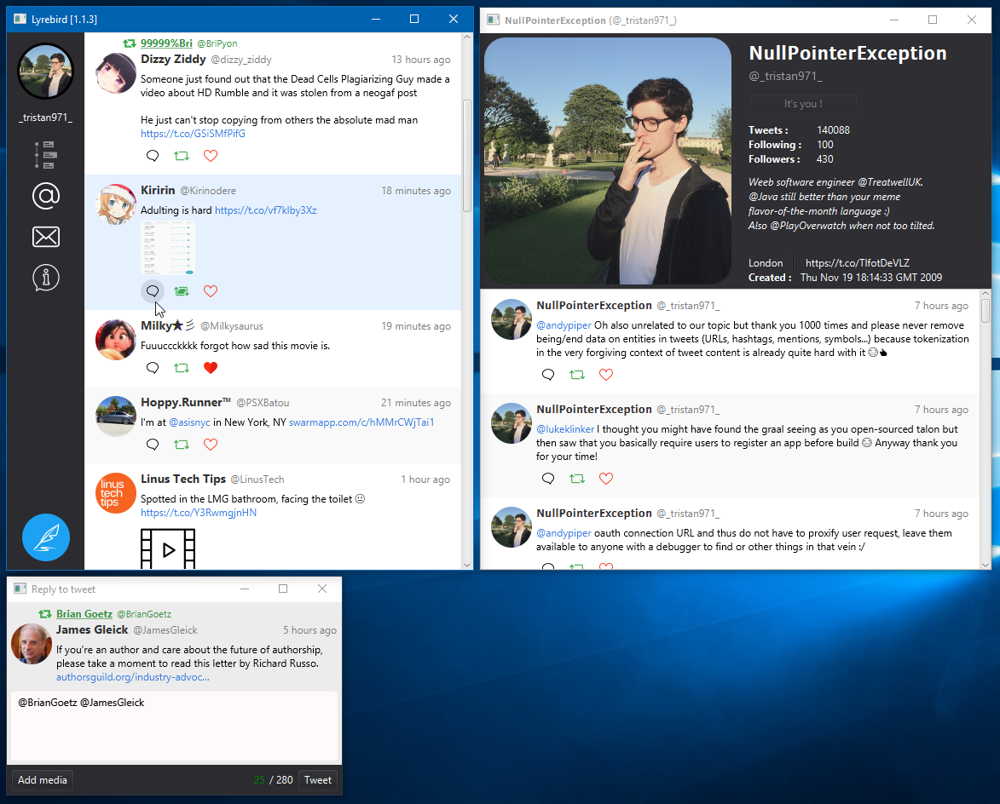

# Lyrebird
###### A next-generation cross-platform Twitter client that doesn't suck.

Last `master` branch's statistics :

Build : 

Quality : 

Trivia : 

## Reasoning :
Currently there is not one good Windows Twitter client.
We aim to fix this, but multiplatform-wise.

Hopefully this works out.

Check out the release pages once we have something working decently.

## Screenshot of current version :

## Currently working :
- [x] Log in 

- [ ] Timeline
    - [ ] Display timeline
        - [x] Basic textual display
        - [x] Display username, @screenname and user profile picture
        - [ ] Display for chosen list
        - [ ] Text highlighting
            - [ ] Mentions
            - [ ] Hashtags
        - [ ] Media embedding
            - [ ] Officially supported
                - [ ] Twitter image embedding
                - [ ] Twitter video embedding
            - [ ] Easy embedding
                - [ ] Direct image embedding
                - [ ] Direct video embedding
            - [ ] Why is it not easy to do ?
                - [ ] Youtube video embedding
    - [x] Seek older tweets on scrolling to end of displayed ones
    - [ ] Seek newer tweets all the time
        - [ ] Scheduled refresh
        - [ ] Streaming API

- [ ] Tweeting
    - [x] Support text
    - [ ] Support image
    - [ ] Support location

- [ ] Add tabs for mentions and hashtag searches

- [ ] Add reply and retweet options

- [ ] Open pictures from within the app

- [ ] Show DM list
